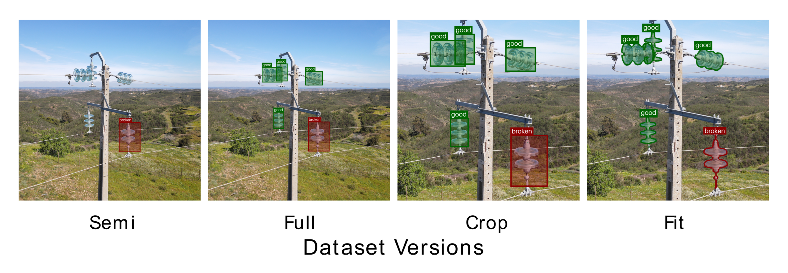
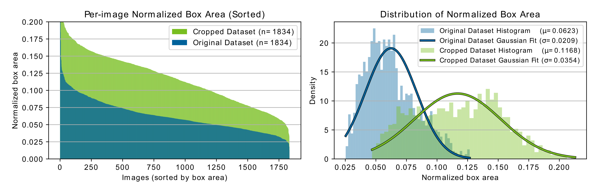
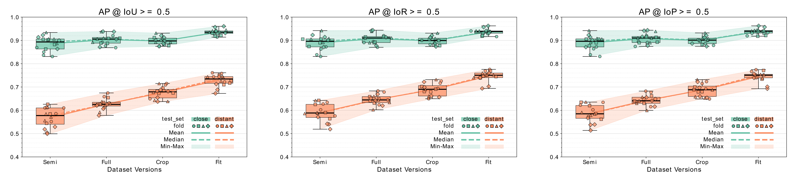

<!-- Add the paper text or supplementary notes. Markdown, math, and code are supported. -->
---

## Overview

<figure>
  <iframe 
    src="graphical_abstract.pdf#toolbar=0&view=Fit&navpanes=0" 
    width="100%" 
    style="aspect-ratio: 1/0.99; border: none;">
    

      This browser does not support PDFs. Please download the PDF to view it:
      <a href="graphical_abstract.pdf">Download PDF</a>.
    

  </iframe>

  <figcaption>
  Overview of the proposed supervision-aware annotation pipeline. Starting from unlabeled data,
  supervision through human annotations is obtained at different scales for defects and assets.
  An initial model $f^1_\theta$, trained on asset-labeled data, generates model-predicted annotations.
  Defect and asset labels are then merged using a supervision-aware function that prioritizes human labels,
  producing a fully labeled dataset. Next, supervision-aware image cropping is applied to "zoom in" on
  regions of interest. Finally, annotation spatial detail is refined via visual prompting with model
  $f^2_\theta$, while preserving the supervised class identities.
  </figcaption>
</figure>

### Background

- Improving Electrical Grid Reliability requires Efficient Maintenance Operations
- UAV Data Collection enables efficient scaling of Visual Inspection Operations
- Human Inspectors focus on defective components, producing Sparse Annotations
- Precise Geometric Annotations have no direct benefit for Inspection Reporting

### Challenges

- Developing High-capacity, Task-specific Models requires Large-scale, Annotated Datasets
- Inspection Reporting and Supervised Learning have different Data Labeling Requirements
- Processing High-resolution imagery is Impractical, while Downsampling risks Losing critical Details.
- Spatially Imprecise Annotations can introduce Misleading Training Signals

### Approach

- Leverage Dataset Construction with Model-assisted labeling for Non-defective instances
- Account for Error-Tolerance Asymmetry by reserving Labeling Effort for Critical instances
- Process Relevant ROIs by Cropping raw images based on Instance Locations
- Refine Spatial Supervision through Visual Prompting of foundation model

<figure>
  
  <figcaption>
  Canonical examples illustrating successive dataset variants. Starting from defect-only supervision, asset annotations are scaled through model-assisted labeling, followed by supervision-aware cropping to focus on regions of interest, and finally refined into polygonal instances using model-assisted spatial localization.
  </figcaption>
</figure>

### Data

- **Collection**
  - Captured: 2023 – 2025
  - Resolution: 24 – 48 MP
  - Images: 1,835

- **Instances**
  - Defective: 1,952
  - Non-defective: 12,790

- **Subsets**
  - Sorting: Normalized object scale
  - Spliting: 10 bins
  - Close-range Test Set: 2nd bin
  - Distant-range Test Set: 9th bin
  - Cross-Fold Validation: k = 4

<figure>
  
  <figcaption>
  Normalized object scale distributions before and after supervision-aware cropping. Cropping increases relative object size while preserving scale variability essential for multi-scale training.
  </figcaption>
</figure>

### Results

- AP@IoU≥50 — Dataset Improvements
  - Close-range: Δμ +5.0% · Δσ −1.8%
    - 0.886 ± 0.031 → 0.936 ± 0.013
  - Distant-range: Δμ +16.0% · Δσ −1.6%
    - 0.569 ± 0.041 → 0.729 ± 0.025
- AP@IoR≥50 — Metric Selection
  - Full Test Set: Δμ +1.0% · Δσ −0.8%
    - 0.778 ± 0.138 → 0.788 ± 0.1

<figure>
  
  <figcaption>
  Detection performance ($AP_{50}$) for broken-class instances across 128 experiments: 2 test $\times$ 4 datasets $\times$ 4 folds $\times$ 4 seeds.
  </figcaption>
</figure>

### Findings

- Contextual Supervision improves Training Convergence: Adding non-defective asset labels increases mean performance and reduces variance
- ROI Cropping benefits Distant Images:  Small object scale limits signal quality, highlighting the importance of matching receptive fields to cue size
- Spatial Detail improves Gradient Quality: Polygonal refinement provides consistent additional gains
- Ground-Truth Noise can Hide Performance:  IoR and IoP reduce sensitivity to spatial annotation imprecision, revealing detections missed by strict IoU

---

## Conference Poster

<iframe 
  src="poster_ICIP_2026_Pedro_Daniel_Rocha_2000dpi.pdf#toolbar=0&view=Fit&navpanes=0" 
  width="100%" 
  style="aspect-ratio: 1 / 1.414; border: none;">
  
This browser does not support PDFs. Please download the PDF to view it: 
    <a href="poster_ICIP_2026_Pedro_Daniel_Rocha_2000dpi.pdf">Download PDF</a>.
  

</iframe>

---

## Conference Paper

<iframe 
  src="ICIP_2026_Annotations_Pipeline_Pedro_Daniel_Rocha_accepted.pdf#toolbar=0&view=Fit&navpanes=0" 
  width="100%" 
  style="aspect-ratio: 1 / 1.294; border: none;">
  
This browser does not support PDFs. Please download the PDF to view it: 
    <a href="ICIP_2026_Annotations_Pipeline_Pedro_Daniel_Rocha_accepted.pdf">Download PDF</a>.
  

</iframe>

---
